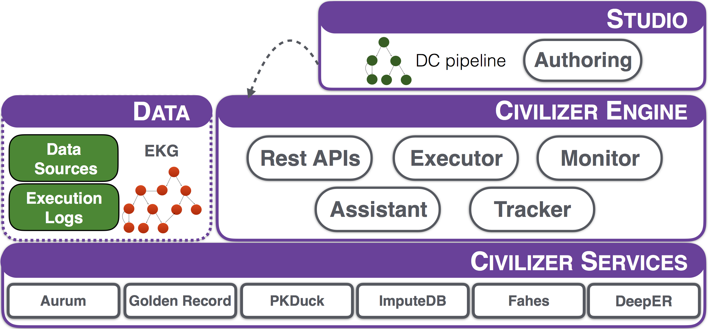

# The Data Civilizer Architecture
Data Civilizer is an end-to-end data preparation system. Data Civilizer provides data discovery and cleaning services. The main components of the civilizer are shown in the below figure. Data Civilizer contains three primary layers, namely the CIVILIZER frontend, the CIVILIZER engine, and the CIVILIZER services. The workflow engine allows a user to string together any of the CIVILIZER services in a directed graph to accomplish her data integration goal. Then the engine manages the execution of services in the directed graph. Users interact with the system via the Civilizer Studio.

 

### In a nutshell, Data Civilizer has the following primary services:

#### A data discovery module, Aurum, to help find datasets of interest. Aurum builds an enterprise knowledge graph (EKG) to connect similar tables. Aurum allows a user to browse the graph, run similarity searches on tables in the graph, and perform keyword searches. Aurum can also help find all join paths that connect these tables. 

#### An entity resolution module to form clusters of records thought to represent the same entity. We are currently using DeepER, a deep learning-based entity resolution module. This can be easily replaced with another module which can do the same job.

#### A golden record module. This component has the effect of collapsing clusters representing the same entity into single representative records. Our golden record system excels at cleaning when there are multiple sources of the same information.  

#### Other cleaning tools in the system include an abbreviation system,  a disguised missing values detection tool (fahes), and ImputeDB for filling in missing values. 

## Docker Installation
You need to install [Docker](https://www.docker.com/community-edition)
and [Docker Compose](https://docs.docker.com/compose/install/)
first, then proceed to the following instructions.

### Development

Get the code

    # clone using https
    git clone --recursive https://github.com/qcri/data_civilizer_system.git
    # or if you prefer ssh
    git clone git@github.com:qcri/data_civilizer_system.git

    cd data_civilizer_system
    
Build all and run:

    docker-compose up

Build one by one:

    docker-compose build apis
    docker-compose build grecord_service
    docker-compose build studio    

Run the system:

    docker-compose up studio

## Authoring and Running Data Civilizer Pipelines 
Run the system, then visit [http://localhost:5000](http://localhost:5000).

The current version of the studio allows the user to add a service and run it; then the user can add another service. That means the user cannot create a full pipeline and then ask the studio to run it. After adding each node, you have to:
  
         - save
         - build 
         - execute   

In the following, there are different pipeline examples based on the uploaded datasets, namely six tables from a university and E-Commerce.

### Fahes service to detect disguised missing
This example check disguised missing values in 6 tables available at /app_storage/data_sets/MIT_Demo/ and write the output at /app_storage/data_sets/MIT_DemoResults/. 

    Run the system and go to http://localhost:5000/#!/editor 
    Create a new pipeline 
    Instantiate a node from the Fahes service
    Add the following values to the source and destination parameters of the service:
    source: /app/storage/data_sets/MIT_Demo/
    destination: /app/storage/data_sets/MIT_DemoResults/     

### ImputeDB service to predict missing values
This example predicts the missing values in Sis_department available at /app_storage/data_sets/MIT_Demo_IM/ and write the output at /app/storage/data_sets/MIT_DemoResults/. 

    Run the system and go to http://localhost:5000/#!/editor 
    Create a new pipeline 
    Instantiate a node from the ImputeDB service
    Add the following values to the source and destination parameters of the service:
    source: /app/storage/data_sets/MIT_Demo_IM/
    destination: /app/storage/data_sets/MIT_DemoResults/ 
    tableName: Sis_department
    Query: select Dept_Budget_Code from Sis_department;
    ratio: 0    

### PKDuck service to fix abbreviations
This example fixes abbreviations in the tables available at /app_storage/data_sets/MIT_Demo/ and write the output at /app_storage/data_sets/MIT_DemoResults/. 

    Run the system and go to http://localhost:5000/#!/editor 
    Create a new pipeline 
    Instantiate a node from the PKDuck service
    Add the following values to the source and destination parameters of the service:
    source: /app/storage/data_sets/MIT_Demo/
    destination: /app/storage/data_sets/MIT_DemoResults/ 
    Columns: 12#11#8
    Tau: 0.8

### Entity matching and Golden Record services
This example creates a pipeline of two services to consolidate data available in two different E-Commerce tables for Amazon and Google items, which are available at /app_storage/data_sets/deeper/Amazon-GoogleProducts. Note that, the entity matching is done using DeepER where a model is pre-trained and available in the same folder.  

    Run the system and go to http://localhost:5000/#!/editor
    Create a new pipeline 
    Instantiate a node from the DeepER service
    Add the following values to the DeepER parameters:
    source: /app/storage/data_sets/deeper/Amazon-GoogleProducts
    destination: /app/storage/data_sets/deeper/output 
    Table1: Amazon_full.csv
    Table2: GoogleProducts_full.csv
    predictionsFileName: select Dept_Budget_Code from Sis_department;
    number_of_pairs: 2500         

After executing the DeepER node, instantiate another node for EntityConsolidation
    
    Add the following values to the EntityConsolidation parameters:
    source: /app/storage/data_sets/deeper/output/
    destination: /app/storage/data_sets/deeper/output/GRRows.csv 
    

